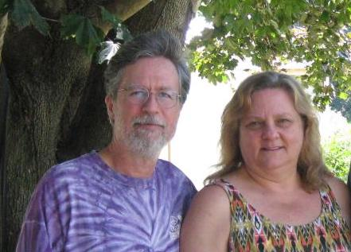

#### About Celadon Acres Farm

We are Abby Rice and Tom Laudeman, farmers growing sweet sorghum and making sorghum syrup (some old timers call it molasses). We also grow Cherokee White corn for corn meal, muscadines, hazelnuts, chinkapins, and a few blueberries.

;

Address:
```
4242 Davis Creek Lane
Lovingston, VA 22949

434-218-3276
```

[Celadon Acres on Google Maps](https://www.google.com/maps/place/Celadon+Acres+Farm/@37.8103661,-78.904618,17z/data=!3m1!4b1!4m5!3m4!1s0x89b36cc1a43abfd9:0xd5a8df784235cd4a!8m2!3d37.8103661!4d-78.9024293)

[Celadon Acres on Bing Maps](https://binged.it/2fFcjA5)

