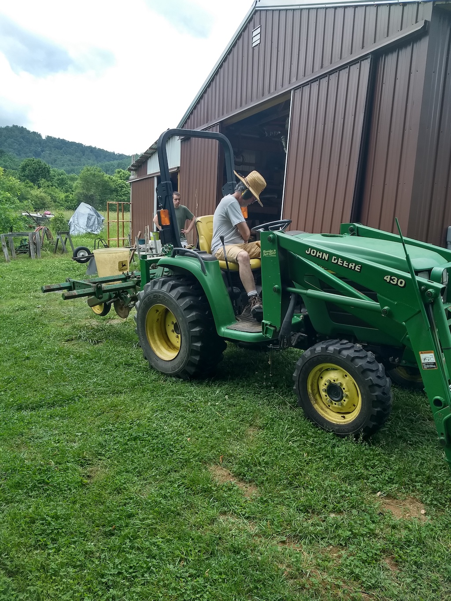

#### Corn planting

Now that the soil has warmed up, we planted Cherokee White dent corn, which is the best for making corn meal. Tom has the planter ready to go in this photo.

#### Sorghum season at Celadon Acres Farm

#### Two rows cut down

In the middle of September we started cutting the sorghum, squeezing the cane, and making syrup. In this
picture, the first two rows have been cut and hauled out of the field.

