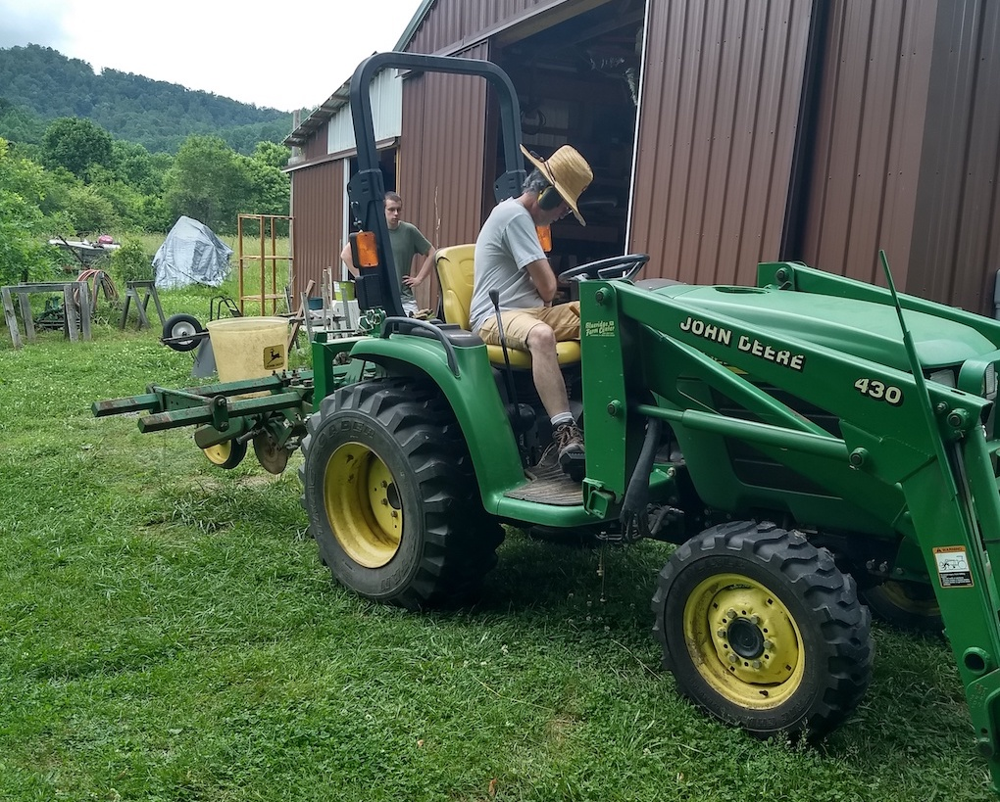

#### Sorghum syrup and corn meal for sale

Both are grown here using sustainable practices, free from herbicides and pesticides. Currently available for purchase: Cherokee White corn meal and sorghum syrup. Cherokee White is an open pollenated, heritage, dent corn that makes sweet, fluffy corn bread. 

To make arrangements for purchase:

- Text or call (please leave message): 434-218-3276
- Email <abby@laudeman.com>
- Pickup at the farm by appointment
- Inquire about delivery

Prices:

- Pure Sorghum syrup, 1 pint $10
- Cherokee White corn meal, 1 pound $2.50

#### Corn planting

Corn is planted in the late spring, when the soil has warmed up. Tom has the planter ready to go in this photo.

#### Sorghum season at Celadon Acres Farm

#### Two rows cut down

In the middle of September we started cutting the sorghum, squeezing the cane, and making syrup. In this
picture, the first two rows have been cut and hauled out of the field.

